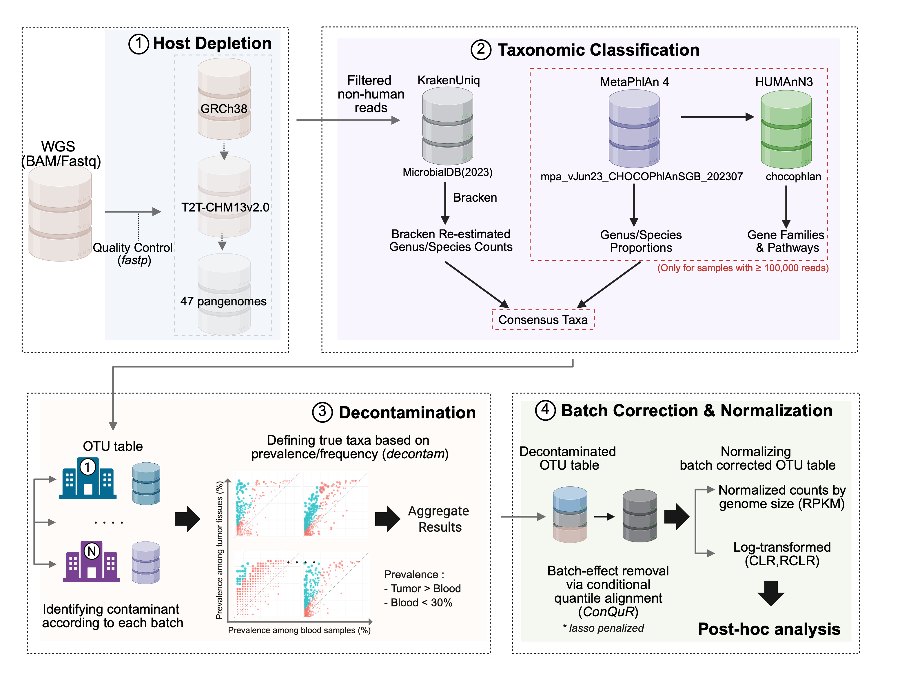

# CMPipeline

**CMPipeline** is a Nextflow pipeline for cancer-microbiome profiling of whole-genome sequencing. It
removes host reads from BAM, CRAM or FASTQ input, classifies what remains with KrakenUniq/Bracken and
MetaPhlAn 4, keeps the taxa both profilers agree on, and can optionally confirm species by alignment,
remove reagent contaminants, correct batch effects and profile function with HUMAnN 3.

## How it works



1. **Read preparation** extracts every primary unmapped read from BAM/CRAM input (or takes single- or
   paired-end FASTQ) and filters the reads with fastp.
2. **Host depletion** removes reads matching the GRCh38 and T2T-CHM13+PhiX minimap2 indexes, and
   optionally a set of pangenome indexes.
3. **Classification** runs KrakenUniq and Bracken on every sample, and MetaPhlAn 4 on samples with at
   least `--consensus_min_reads` (100,000) classified reads.
4. **Consensus** keeps the genera both profilers detect and applies that list to every sample's Bracken
   counts.
5. **Alignment validation** *(opt-in)* aligns reads to RefSeq genomes of each species, with human in the
   same index, and zeroes species whose reads do not come from their genome.
6. **Decontamination** *(on by default)* calls reagent contaminants per shipment batch with the
   `decontam` prevalence method and removes them.
7. **Batch correction** *(opt-in)* removes batch effects with ConQuR.
8. **Functional profiling** *(opt-in)* runs HUMAnN 3 on the MetaPhlAn samples.

Every run also writes a MultiQC report, a one-row-per-sample QC table, a self-contained cohort report and
a provenance record of the exact code, parameters, databases and environments used.

## Installation

### 1. Requirements

- Nextflow **>= 24.10.0** with Java 17+ (verified on 24.10.0 and 26.04.6)
- Conda or Mamba. Nextflow builds each tool's environment from its exact lockfile in
  `conda_envs/lock/` on first use.

### 2. Clone CMPipeline

```bash
git clone https://github.com/ammalabbasi/CMPipeline.git
cd CMPipeline
```

### 3. Databases

| Database | Parameter | Needed for |
|---|---|---|
| GRCh38 minimap2 index | `--hg38_db` | host depletion |
| T2T-CHM13 + PhiX minimap2 index | `--t2t_phix_db` | host depletion |
| HPRC pangenome `.mmi` (one file or a directory) | `--pangenome_db` | optional extra host depletion |
| KrakenUniq/Bracken database | `--kraken_db` | classification; must contain `database<N>mers.kmer_distrib` for `--bracken_read_length` |
| MetaPhlAn 4 database (vJun23) | `--metaphlan_db` | classification |
| ChocoPhlAn v201901_v31 + UniRef90 | `--humann3_nucleotide_db`, `--humann3_protein_db` | HUMAnN 3 only |

### 4. Batch-correction environment (only if you use batch correction)

ConQuR is not packaged for conda, so batch correction runs in a pre-built environment:
`sbatch conda_envs/build_envs.sbatch` builds it, with cqrReg 1.2.1 and the pinned ConQuR commit, and
`--batch_corr_env` points at it. See the [batch-correction guide](docs/running/batch_correction.md).

## Running CMPipeline

### Sample sheet

A CSV with a unique `patient` identifier and FASTQ, BAM or CRAM paths. Mixed input types are fine with
`--input_data_type auto`.

```csv
patient,fastq_1,fastq_2
sample01,/data/sample01_R1.fastq.gz,/data/sample01_R2.fastq.gz
sample02,/data/single_end.fastq.gz,
```

```csv
patient,bam
sample03,/data/sample03.bam
```

For CRAM, use a `cram` column and add `cram_reference` (or `--cram_reference`) when the file needs an
external reference; sequence names, lengths and MD5s are checked against it before decoding. Sample IDs
must be unique and may contain letters, numbers, `.`, `_` and `-`. Use absolute paths on a cluster.

### Quick start

```bash
nextflow run main.nf -profile tscc \
    --sample samples.csv \
    --hg38_db /refs/human-GRC-db.mmi \
    --t2t_phix_db /refs/human-GCA-phix-db.mmi \
    --kraken_db /db/krakenuniq \
    --metaphlan_db /db/metaphlan \
    --run_decontam false \
    -resume
```

Decontamination is on by default and needs a metadata file and four sample-role parameters; the command
above turns it off so a cohort can be profiled first. Every parameter is checked before the first task
runs, so a wrong path fails in seconds, not hours in.

### Parameters

The main options. [`docs/parameters.md`](docs/parameters.md) lists all of them.

| Parameter | Values/default | Required | Description |
|---|---|:---:|---|
| `--sample` | CSV path | Yes | the sample sheet |
| `--input_data_type` | `auto` (default), `bam`, `cram`, `fastq` | No | select or check the input format |
| `--cram_reference` | FASTA path | No | the CRAM reference when it is not embedded |
| `--hg38_db`, `--t2t_phix_db` | `.mmi` paths | Yes | host-depletion indexes |
| `--pangenome_db` | not set | No | extra pangenome depletion (one `.mmi` or a directory of them) |
| `--kraken_db`, `--metaphlan_db` | directories | For classification | classifier databases |
| `--outdir` | `RESULTS/` in the launch directory | No | output directory |
| `--adapter_trim` | `auto` (default), `always`, `never` | No | adapter FASTA scan; `auto` skips it for reads from BAM/CRAM |
| `--consensus_min_reads` | `100000` | No | classified reads a sample needs for MetaPhlAn (and HUMAnN) |
| `--run_decontam` | `true` | No | decontamination; needs `--metadata_file` + role parameters |
| `--metadata_file` | TSV/CSV path | With decontam or batch correction | per-sample metadata |
| `--taxonomic_rank` | `genus`, `species` | With decontam or batch correction | the table to decontaminate/correct |
| `--cohort_preset` | `tcga` | No | the TCGA sample-role contract in one flag |
| `--control_role`, `--positive_values`, `--control_values` | see guide | With decontam (unless `--cohort_preset`) | which samples are material and which are controls |
| `--run_alignment_validation` | `false` | No | alignment validation of species calls |
| `--run_batch_correction` | `false` | No | ConQuR batch correction |
| `--batch_corr_covariates` | `age_diag,sex,bmi` | With batch correction | metadata columns ConQuR adjusts for (at least one) |
| `--skip_humann3` | `true` | No | set `false` to run HUMAnN 3 |
| `--start_from` | `beginning`, `decontam`, `batch_correction` | No | enter at a later stage from an existing table |
| `--sample_failure_strategy` | `finish` (default), `ignore` | No | whether one sample's failure stops the run |
| `--save_intermediates` | `false` | No | also publish intermediate read files |

Boolean flags accept only `true` or `false`.

### Choose a run mode

| I want to... | Guide |
|---|---|
| Understand classification, the MetaPhlAn gate and consensus | [Classification and consensus](docs/running/classification.md) |
| Remove reagent contaminants | [Decontamination](docs/running/decontamination.md) |
| Confirm species calls by alignment | [Alignment validation](docs/running/alignment_validation.md) |
| Correct batch effects | [Batch correction](docs/running/batch_correction.md) |
| Profile function | [HUMAnN 3](docs/running/humann.md) |
| Run on TSCC, Slurm, Biowulf, PBS, LSF or SGE | [HPC guide](docs/hpc.md) |
| Find a specific output file or QC column | [Outputs](docs/outputs.md) |

## Main output folders

Under `--outdir`; each folder can be moved with its own parameter.

| Folder | What is in it |
|---|---|
| `UNMAPPED_BAM/` | fastp reports and read counts, including the BAM/CRAM library size |
| `FASTQC/`, `MULTIQC/` | FastQC at every stage and the combined MultiQC report |
| `MAPPED_READS/` | the host-depleted FASTQ and per-stage depletion counts |
| `BRACKEN/`, `METAPHLAN4/` | per-sample and merged classifier tables |
| `CONSENSUS_TAXA/` | consensus genus and species tables, `consensus_status.tsv` |
| `06_VALIDATION/` | alignment-validation statistics and the masked tables |
| `04_DECONTAMINATION/` | the decontaminated table, contaminant calls, per-sample roles |
| `05_BATCH_CORRECTION/` | corrected tables, PERMANOVA summary, correction status |
| `HUMANN3/` | gene families and pathways |
| `QC_SUMMARY/` | `cmp.qc.summary.tsv` (one row per sample, 36 columns) and `cmp_cohort_report.html` |

Run records (`trace.txt`, `report.html`, `RUN_REPORT.txt`, `provenance/`) go to `pipeline_info/` in the
launch directory. Details: [Outputs](docs/outputs.md).

## Testing

```bash
bash tests/run_smoke.sh                     # unit tests, conda YAML checks, profile parsing (seconds)
bash tests/integration/run_integration.sh /tmp/cmp_it   # runs the real pipeline on synthetic data (minutes)
```

To check a command without running anything, add `-preview`: parameters and paths are validated and the
task graph is built.

## Changes

[`docs/CHANGELOG.md`](docs/CHANGELOG.md) lists the changes in this version, including the fixes that
change results; read it before comparing with older output.

## Support

Report problems with the Nextflow version, profile, sample-sheet format and parameters used. The
`pipeline_info/RUN_REPORT.txt` of the run records all of them.
