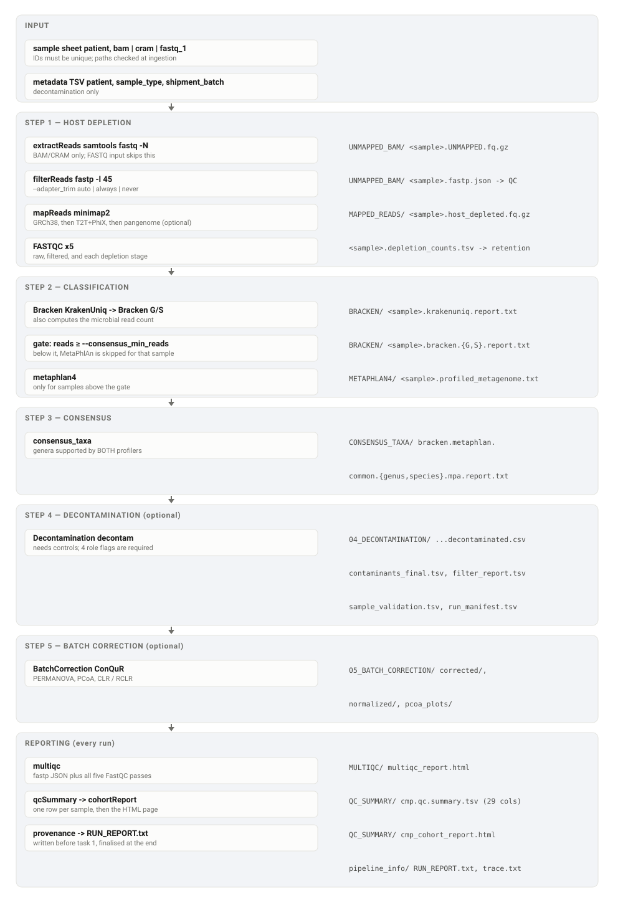

# CMPipeline

CMPipeline is a Nextflow workflow for sequential host-read depletion followed by
microbial taxonomic profiling (KrakenUniq/Bracken and MetaPhlAn 4), consensus taxa,
and optional decontamination and batch correction.

## Workflow



Processes on the left, what each writes on the right. Steps 4 and 5 are optional and can
also be entered directly with `--start_from`, which is how a decontamination-only run
avoids recomputing anything upstream.

## Requirements

- Nextflow **>= 24.10.0** and Java 17+. Verified on 24.10.0 and 26.04.6; 26.04.6 is
  what we run. No `NXF_VER` pin is needed any more.
- Conda or Mamba. Nextflow builds each tool environment from its exact lockfile in
  `conda_envs/lock/`; batch correction instead uses a pre-built environment (see *Conda/Mamba*)
- Minimap2 indexes for GRCh38, T2T-CHM13+PhiX, and optionally HPRC pangenomes
- KrakenUniq/Bracken and MetaPhlAn databases for classification

The generic default is local execution. Site-specific database paths are supplied
on the command line or by an execution profile.

## Input sample sheet

The CSV must contain a unique `patient` identifier and either FASTQ, BAM, or
CRAM input. FASTQ may be single-end or paired-end; columns may be named
`fastq_1`/`fastq_2` or `r1`/`r2`, and the second mate is optional.

```csv
patient,fastq_1,fastq_2
sample01,/data/sample01_R1.fastq.gz,/data/sample01_R2.fastq.gz
sample02,/data/single_end.fastq.gz,
```

```csv
patient,bam
sample03,/data/sample03.bam
```

For CRAM, add `cram_reference` (or pass `--cram_reference`) when the file
requires an external reference. CMPipeline validates CRAM sequence names, lengths,
and MD5 values against that FASTA before decoding:

```csv
patient,cram,cram_reference
sample04,/data/sample04.cram,/refs/GRCh38.fa
```

Use `--input_data_type auto` (default) or explicitly select `bam`, `cram`, or
`fastq`. In `auto` mode, each row is detected independently, so a sheet may mix
input types. Populate only the columns for the intended input type; invalid or
incomplete rows fail before processing begins.

## Running the workflow

Set the required database parameters for your installation. `--metaphlan_index` names
the Bowtie2 index inside `--metaphlan_db` and defaults to
`mpa_vJun23_CHOCOPhlAnSGB_202307`; change it in one place when the database is updated.

```bash
nextflow run main.nf -profile local \
  --sample samples.csv --input_data_type auto \
  --hg38_db /refs/human-GRC-db.mmi \
  --t2t_phix_db /refs/human-GCA-phix-db.mmi \
  --pangenome_db /refs/pangenome_mmi \
  --kraken_db /db/krakenuniq \
  --metaphlan_db /db/metaphlan
```

Decontamination is on by default and needs a metadata file and four sample-role parameters
(see *Decontamination*); add `--run_decontam false` to profile a cohort without it.

`--pangenome_db` is optional. When omitted, reads surviving the GRCh38 and
T2T+PhiX filters proceed directly to classification. It may point to one `.mmi`
file or a directory containing `.mmi` files.

On TSCC, `scripts/batch_scripts/main.sbatch` submits the run; it takes the sample
sheet as its first argument and passes anything further to Nextflow. See
`scripts/batch_scripts/README.md` — the other scripts in that directory still carry no
Slurm directives and are not submittable as they stand.

For a restart, use `-resume`; output directories are not used as a manual cache.
To run only selected stages, use `--skip_host_depletion`, `--skip_classification`,
`--skip_consensus`, `--skip_humann3`, `--run_decontam`, or
`--run_batch_correction`. `--skip_multiqc` and `--skip_cohort_report` switch off the two
reports (see *Quality control and reporting*).

A few run-wide settings:

| Parameter | Default | Meaning |
|---|---|---|
| `--outdir` | `RESULTS/` in the launch directory | where every stage publishes (see *Outputs*) |
| `--sample_failure_strategy` | `finish` | what one sample's failure does. `finish` stops the run once running tasks end; `ignore` lets the other samples complete and lists the failures in `RUN_REPORT.txt` and `trace.txt`. Cohort-level steps (merges, consensus, decontamination, batch correction, reports) always stop on failure |
| `--save_intermediates` | `false` | also publish intermediate read files (extracted, filtered and per-stage depleted FASTQ, MetaPhlAn Bowtie2 output). By default only the host-depleted FASTQ is published; everything else stays in `work/` |
| `--start_from` | `beginning` | `decontam` or `batch_correction` enters at that stage from an existing table (see those sections) |

Boolean flags accept only `true` or `false`; anything else stops the run at launch.

All path parameters are validated before the first task is submitted, so a
missing database or a flag passed without a value fails in seconds rather than
hours into host depletion.

### HPC profiles

- `-profile tscc` uses the TSCC Slurm queue/account and TSCC database defaults.
  Pangenome depletion is **not** among them: that index set is large enough that
  enabling it silently would dominate every run, so pass `--pangenome_db` explicitly
  when you want it.
- `-profile slurm` is a generic Slurm profile; override `process.queue` and
  `process.clusterOptions` in a site overlay.
- `-profile pbs` and `-profile lsf` provide generic PBS/Torque and LSF templates.
- `-profile biowulf` targets NIH Biowulf (the `norm` partition, conservative scheduler
  polling, and `--gres=lscratch:` from `--biowulf_lscratch_gb`).
- `-profile sge` is a generic Sun/Oracle Grid Engine template.
- `-profile local` runs on the current machine. It caps total concurrency at 8 CPUs and
  32 GB deliberately: `process.resourceLimits` bounds each individual task, but only
  `executor.cpus`/`executor.memory` stop a local run swamping a shared login node.

Example TSCC launch:

```bash
nextflow run main.nf -profile tscc --sample samples.csv -resume
```

For another cluster, copy the relevant `conf/*.config` file or provide an overlay:

```bash
nextflow run main.nf -profile slurm -c my-site.config --sample samples.csv
```

### Conda/Mamba

Conda is enabled by default. To use Mamba where available:

```bash
nextflow run main.nf -profile local,mamba --sample samples.csv
```

Built environments are cached in `.conda_cache/` next to the workflow rather than
inside the work directory, so they survive a work-directory cleanup and are shared
between runs. Override with `NXF_CONDA_CACHEDIR` or `conda.cacheDir` in a site profile.

Each tool environment is built from an exact lockfile, `conda_envs/lock/<env>.linux-64.txt`
(`conda list --explicit`), selected by the `--<tool>_env` parameters listed under
*All parameters*. The `.yml` beside each lockfile is its human-readable source, and
`conda_envs/build_envs.sbatch` regenerates the lockfiles. A pre-existing environment such as
`nf-env` may be used to launch Nextflow, but tool environments are still built from the lockfiles.

**Batch correction is the exception: it runs in a pre-built environment**,
`--batch_corr_env` (on TSCC,
`/tscc/projects/ps-lalexandrov/shared/CMPipeline_nextflow/envs/batch_correction_20260923`).
ConQuR is not packaged for conda, so an environment built from the lockfile alone would lack it.
`sbatch conda_envs/build_envs.sbatch` builds that environment and runs
`scripts/install_conqur.R` in it, which installs cqrReg 1.2.1 and the `ivartb/ConQuR_par` fork
of ConQuR at the commit in `--conqur_sha`. Before batch correction starts, the workflow checks
that ConQuR is installed **at that exact commit** and stops with the command to fix it
otherwise. On another site, build the environment the same way and point `--batch_corr_env` at it.

## Adapter trimming

`--adapter_trim` controls whether fastp scans reads against `--adapters`
(`ref/known_adapters.fna`, 234 sequences):

- `auto` (default) scans raw FASTQ input, and skips the scan for reads extracted
  from a BAM or CRAM, which were adapter-trimmed before they were aligned.
- `always` scans every sample; `never` scans none.

The scan is expensive and, on aligned input, produces nothing: measured on one
aligned CRAM, `filterReads` took 2 h 50 m with `--adapter_fasta` and 3 m 15 s
without it, with fastp reporting no adapter detected and 0 reads trimmed.
Skipping the FASTA scan does not disable adapter trimming; fastp still
auto-detects adapters.

## Samples with no reads

A sample that has no reads left after filtering is logged and dropped; the rest
of the run continues. This covers aligned input that carries no unmapped records,
which is common for RNA-seq BAMs written without STAR's `--outSAMunmapped Within`.

## Classification and consensus behavior

KrakenUniq and Bracken run first for every sample. The sample's classified microbial read
count, the clade count of the `root` row of its KrakenUniq report, is a per-sample gate:
**MetaPhlAn 4 runs only when that count is at least `--consensus_min_reads` (100000).**
Samples below the gate are logged and skip MetaPhlAn, and therefore HUMAnN3 too (see
*Functional profiling*). Their Bracken counts still go forward. The QC summary's
`bracken_microbial_reads` and `cleared_consensus_gate` columns show, per sample, the count and
whether it cleared.

| Parameter | Default | Meaning |
|---|---|---|
| `--consensus_min_reads` | `100000` | the MetaPhlAn gate above; a non-negative integer (`1e5` is rejected) |
| `--bracken_read_length` | `50` | Bracken `-r`; the Kraken database must hold a `database<N>mers.kmer_distrib` for it, checked at launch |
| `--bracken_threshold` | `2` | Bracken `-t`: the minimum reads a taxon needs to be re-estimated. A read threshold, not a thread count. A thin sample in which no taxon reaches it gets an empty no-call table instead of failing the run |

```bash
nextflow run main.nf --consensus_min_reads 100000 --bracken_read_length 50 --bracken_threshold 2
```

**Consensus** (`scripts/compute_consensus_taxa.py`) decides which genera are believable by
asking both profilers. It learns from the samples that have *both* a MetaPhlAn profile and a
Bracken table, which are exactly the samples that cleared `--consensus_min_reads`. Across those
samples, a genus is kept if it is present in at least 1% of them by Bracken **and** at least 1%
by MetaPhlAn. The consensus genus list is then applied to the Bracken tables of **all**
samples, including those below the gate: the output tables are Bracken counts restricted to
consensus genera (and, for species, to species of those genera). No taxon, including
*Cutibacterium*, is hard-coded out of the analysis.

**Pass-through.** With fewer than 2 such samples there is nothing to learn a consensus from,
so the Bracken tables pass through unfiltered, under the same file names, and the run continues.
This includes the case where no sample cleared the gate and MetaPhlAn never ran.
`CONSENSUS_TAXA/consensus_status.tsv` records which path ran, as counts only (no sample IDs):

| Key | Meaning |
|---|---|
| `mode` | `consensus` or `bracken_passthrough` |
| `reason` | why, when it passed through |
| `samples_in_bracken`, `samples_with_metaphlan`, `samples_used_for_consensus` | the sample counts at each step |
| `samples_above_min_reads` | samples whose Bracken **genus** total reaches the threshold. Reported for comparison only; the gate uses the KrakenUniq root count |
| `genus_rows_out`, `species_rows_out` | rows in the output tables |

Check `mode` before interpreting a run's taxa: a pass-through table has not been filtered by
agreement between the two profilers. The cohort report shows the same status.

Consensus also writes `bracken_library_sizes.tsv`, each sample's total Bracken reads before any
filtering. Decontamination uses it to tell a sample that is all-zero after filtering from one
whose library was empty.

## Decontamination

Batch-aware, prevalence-based contamination detection with the `decontam` R package
(`scripts/decontamination.R`). It is reached three ways: as part of a full run
(`--run_decontam true`), from an existing consensus table
(`--start_from decontam --consensus_otu_table <path>`), or not at all (`--run_decontam false`).
**`--run_decontam` defaults to `true`**, so a full run must either supply the parameters below
and `--metadata_file`, or pass `--run_decontam false`; otherwise it stops at launch.

**Four parameters are required whenever decontamination runs, and have no default.**
Naming which samples are the real material and which stand in for blanks is a scientific
choice, not something the pipeline should guess:

| Parameter | Meaning |
|---|---|
| `--taxonomic_rank` | `genus` or `species` — which consensus/Bracken table to decontaminate |
| `--control_role` | `experimental_blank` (true blanks) or `surrogate_biological` (a sample class standing in for blanks) |
| `--positive_values` | the sample types that are real material, i.e. **not** controls |
| `--control_values` | the sample types used as negative controls |

A run that omits any of them stops in about a second with a named error rather than
guessing. `--type_column` says which metadata column holds the role and defaults to
`sample_type`.

For TCGA, one flag supplies the whole contract — the manuscript's model, with blood-derived
normals as surrogate negative controls:

```bash
nextflow run main.nf -profile tscc --sample samples.csv \
  --metadata_file metadata.tsv --run_decontam true \
  --cohort_preset tcga --taxonomic_rank genus
```

`--cohort_preset tcga` sets `--type_column "Sample Type_x"`,
`--positive_values "Primary Tumor,Solid Tissue Normal"` and
`--control_values "Blood Derived Normal"`. Passing any of them a conflicting value is an
error rather than a silent override. Note that the positives include Solid Tissue Normal:
it is real material, not a blank.

For a cohort with Tumor/Normal in a `Type` column, state them:

```bash
nextflow run main.nf -profile tscc --sample samples.csv \
  --metadata_file metadata.tsv --run_decontam true --taxonomic_rank genus \
  --type_column Type --control_role experimental_blank \
  --positive_values Tumor --control_values Normal
```

A sample whose type matches neither list stops the run, because
`--unselected_type_policy` defaults to `error`; set it to `exclude` to drop those samples
instead.

The other columns and table layout:

| Parameter | Default | Meaning |
|---|---|---|
| `--metadata_file` | none (required) | per-sample metadata, tab- or comma-separated |
| `--sample_id_column` | `sampleid` | metadata column holding the sample IDs |
| `--batch_column` | `shipment_batch` | metadata column holding the batch; also used by batch correction |
| `--taxon_column` | `clade_name` | taxonomy column in the OTU table; every other column is a sample |

The ID, type and batch columns are checked against the metadata header at launch.

**How a contaminant is called.** Taxa are pre-filtered, then tested batch by batch with
decontam's prevalence method, then called across batches:

| Parameter | Default | Meaning |
|---|---|---|
| `--decontam_min_abundance` | `5` | a taxon's reads in a sample below this count as absent |
| `--decontam_min_prevalence` | `0.05` | after that filter, a taxon must be present in at least 5% of samples to be tested |
| `--decontam_threshold` | `0.1` | decontam's prevalence-test threshold |
| `--decontam_min_batches` | `2` | a taxon flagged in at least this many batches is a contaminant |
| `--min_total_per_batch`, `--min_positive_per_batch`, `--min_control_per_batch` | `5`, `1`, `1` | a batch with fewer samples, positives or controls than this is not tested |

`--decontam_min_prevalence` 0.05 matches the published method ("≥5 reads, detected in ≥5% of
samples" for CRC). It was 0.02 until 2026-09-22; results produced before then are not
comparable.

Contaminants are removed **globally**, not zeroed per batch.

**All-zero samples.** A sample whose counts are all zero in the table being decontaminated
(for example, a normal that carries none of the consensus genera) is evidence that those taxa
are absent, not a broken sample:

| Parameter | Default | Meaning |
|---|---|---|
| `--decontam_zero_total_policy` | `keep` | `keep`: an all-zero sample stays in the prevalence test, as long as its library was not empty. `drop`: every all-zero sample is excluded (the older behaviour, which could remove a batch's controls) |
| `--decontam_min_library` | `1000` | under `keep`, an all-zero sample whose total Bracken library is below this is excluded as `insufficient_library` |
| `--decontam_library_sizes` | none | the library-size table for `--start_from decontam`: pass the `bracken_library_sizes.tsv` that consensus wrote. In a full run it is supplied automatically |
| `--decontam_allow_unknown_library` | `false` | an all-zero sample whose library size is unknown stops the run unless this is `true`, in which case it is kept |

**Taxa that cannot be tested.** A taxon present in a batch but in fewer than 2 of its samples
cannot be tested there; decontam returns no answer.

| Parameter | Default | Meaning |
|---|---|---|
| `--decontam_unevaluable_policy` | **`skip`** | `skip`: record the taxon as `unevaluable` in that batch and not flagged there; the `--decontam_min_batches` rule then decides from the batches that could test it. `error`: stop the run |

Under `skip`, a taxon testable in fewer than `--decontam_min_batches` batches can never be called
a contaminant, however contaminant-like it looks. `contaminants_final.tsv` shows this per taxon
in `n_evaluable_batches` and `callable`; read "not a contaminant" as "could not be called" where
`callable` is `FALSE`.

**Outputs**, under `04_DECONTAMINATION/<run>/`, all prefixed with the run name:
`decontam_pkg_decontaminated.csv` (the cleaned table), `contaminants_by_batch.tsv`,
`contaminants_final.tsv`, a per-taxon `filter_report.tsv` carrying a `terminal_reason`,
`sample_validation.tsv` (every sample's role and whether it was used or excluded, and why),
`validated_metadata.tsv`, `batch_eligibility.tsv`, `run_manifest.tsv` (every setting and input
checksum), `decontamination_summary.txt` and `decontamination_plots/`.

To decontaminate an existing consensus table without rerunning anything upstream:

```bash
nextflow run main.nf -profile tscc --start_from decontam --run_decontam true \
  --consensus_otu_table CONSENSUS_TAXA/bracken.metaphlan.common.genus.mpa.report.txt \
  --decontam_library_sizes CONSENSUS_TAXA/bracken_library_sizes.tsv \
  --metadata_file metadata.tsv --taxonomic_rank genus --cohort_preset tcga
```

## Batch correction (opt-in)

`--run_batch_correction true` removes batch effects from the decontaminated table with ConQuR
(`scripts/2500703_batch_correction_normalization.r`), then normalises it and measures how much
variance batch explains before and after. It takes its input from decontamination, or from
consensus/Bracken when decontamination is off, or from an existing table with
`--start_from batch_correction --decontam_otu_table <path> --metadata_file <path>`. It uses
`--batch_column`, `--sample_id_column` and `--type_column` from the decontamination settings.

| Parameter | Default | Meaning |
|---|---|---|
| `--batch_corr_covariates` | `age_diag,sex,bmi` | comma-separated metadata columns ConQuR adjusts for. Every named column must exist in the metadata, or the run stops with a named error |
| `--batch_corr_method` | `tune` | `tune` (auto-phased Tune_ConQuR) or `vanilla` (default ConQuR settings). Nothing else is accepted: ComBat is not implemented |
| `--phase` | `auto` | only `auto` is implemented: phase 1 (16 settings), then phase 3 if phase 1 did not reduce the batch effect enough |
| `--r2_threshold` | `0.25` | phase 1 is accepted if it cuts the batch R² by at least this fraction |
| `--tumor_only` | `false` | correct tumours only. Which types count as tumours is `--batch_corr_tumor_values` |
| `--batch_corr_tumor_values` | `Tumor` | comma-separated, case-insensitive. Not the same as decontamination's `--positive_values`, which means "not a control" |
| `--batch_corr_allow_uncorrected` | `false` | a failed correction stops the run. `true` continues with the raw counts, published as `corrected/UNCORRECTED_passthrough.tsv`, never under a corrected name |
| `--batch_corr_env` | pre-built TSCC env | see *Conda/Mamba* |
| `--conqur_sha` | `ff233085…` | the ConQuR commit the script was written against; any other install is refused |

**What ConQuR needs**, and what happens without it:

- **At least one covariate that varies within every batch.** `--batch_corr_covariates none`
  fails loudly, by design: ConQuR builds its model from covariates plus batch and cannot run on
  batch alone. A covariate that is constant within any one batch is dropped with a warning; if
  that leaves none, the tuned method fails.
- **At least 20 samples** for the tuned method, after these removals, each logged: samples that
  are all-zero after decontamination (listed in `batch_correction_sample_status.tsv`), samples
  with an unknown or missing batch, samples missing any covariate value, and batches with fewer
  than 5 samples.

A failure writes `corrected/BATCH_CORRECTION_STATUS.tsv` (`failed`, the reason and sample counts)
and stops the run, unless `--batch_corr_allow_uncorrected true`.

**Outputs**, under `05_BATCH_CORRECTION/<run>/`: `corrected/ConQuR_tuned.tsv` and
`ConQuR_tuned_parameters.txt` (the file keeps this name under `--batch_corr_method vanilla`
too; its parameters file then reads `Phase used: vanilla`), `corrected/BATCH_CORRECTION_STATUS.tsv`,
`normalized/` (the raw and corrected tables under several transforms), `pcoa_plots/`,
`permanova_summary.tsv` (batch and covariate R² for every table and transform; check this to
judge the correction) and `batch_correction_sample_status.tsv`.

## Alignment validation (opt-in)

`--run_alignment_validation true` adds a step between consensus and decontamination that asks
whether each taxon's reads actually come from its genome. It catches misassignment that two
agreeing classifiers can share: reads piled on rRNA operons or a plasmid, reads of an absent
relative, and "shadow" species that only share reads with a real one.

**When to turn it on.** For a cohort whose species-level calls you will report or build on,
once the cohort has run through consensus at least once and you know which taxa matter. It is off
by default because it is the most expensive step after host depletion: it downloads and indexes
RefSeq genomes for every species in the table and re-aligns every sample's host-depleted reads.
It needs the full run (`--start_from beginning`, host depletion and classification on), the
Kraken `taxDB` (from `--kraken_db`, or `--validation_taxdb`), and internet on the compute node
unless `--validation_ref` supplies a pre-built reference.

**What changes downstream.** Bracken counts remain the quantity. Validation only sets a count to
0 where the taxon *failed* in that sample, and decontamination then runs twice, on the validated
species table and on its genus roll-up.

1. **Species list.** Species in the table going downstream (consensus, or Bracken when consensus
   passed through) with >= `--validation_min_support` reads in at least one sample, matched to NCBI
   taxids through the Kraken database's own `taxDB`.
2. **Reference**, built once per species list and cached under `--validation_cache_dir`:
   - up to `--validation_max_genomes` (50) RefSeq genomes per species (Complete Genome if any), de-duplicated at
     `--validation_dedup_ani` (99.5%) with skani
   - **human T2T in the same index**, so leftover human reads compete
   - one single-part minimap2 index (the run stops if it would split)
   - every accession and checksum in `validation_reference_manifest.tsv`
   - needs internet on the compute node
3. **Alignment.** Each sample's host-depleted reads, `--validation_batch_size` samples per task in one
   minimap2 stream, so the index loads once per batch.
4. **Status** per sample x species, with every statistic in `06_VALIDATION/validation_stats.all.tsv`:
   - tested in this order: `unsupported` if Bracken gave it at least 25 reads but fewer than 10 align to
     it (`--validation_min_confirmed`; the cutoff PRISM uses; the reads are not this species');
     `insufficient` if fewer than 25 supporting reads over all its genomes;
     `failed` if the unique fraction is `< 0.02` (its reads all belong to another species too);
     `insufficient` if fewer than 25 reads land on its best genome (spread thin over many strains);
     `validated` if the 10 kb spread `bins_ratio >= 0.5` and median identity `>= 0.98`; otherwise `failed`,
     with `fail_reason` naming each test
   - `not_in_reference`: no genome in the reference, or Homo_sapiens (never scored)
   - pooled over all of a species' genomes: supporting/unique/multi reads, unique fraction, identity;
     best genome only: breadth, bins, `reads_on_best`. `minimap2_count` equals `unique_reads`.
   - E. coli + Shigella are scored as one taxon (`ref/validation_groups.tsv`).
5. **Mask.** Bracken counts stay the quantity. A count is set to 0 **only where the taxon failed or was
   unsupported** in that sample. The masked species table and its genus roll-up both go to decontamination, and
   `decontam_species_vs_genus.tsv` compares the two sets of calls. Batch correction continues from
   `--taxonomic_rank`.

The thresholds come from a simulation benchmark on public genomes (21 CRC-relevant species; reliable from
about 100 read pairs per taxon, zero false calls). **Identity 0.98 is the least certain for real reads**
(about 1% error); check `validation_stats.all.tsv` after the first real run. `--validation_export_reads true`
also writes the reads supporting each validated taxon. Those are sample-derived reads: protected data.

| Parameter | Default | Meaning |
|---|---|---|
| `--run_alignment_validation` | `false` | turn the lane on |
| `--validation_min_support` | `25` | reads on the best genome for a species to be listed, and for a sample x species to be scored at all |
| `--validation_min_bins_ratio` | `0.5` | 10 kb windows hit / windows expected for that many read pairs |
| `--validation_min_identity` | `0.98` | median alignment identity |
| `--validation_min_unique_frac` | `0.02` | reads unique to the species / all its reads |
| `--validation_max_genomes` | `50` | RefSeq genomes per species, before de-duplication |
| `--validation_dedup_ani` | `99.5` | skani ANI at which two genomes of a species count as one |
| `--validation_max_missing_frac` | `0.10` | the build fails if more than this fraction of species get no genome |
| `--validation_batch_size` | `20` | samples per alignment task |
| `--validation_groups` | `ref/validation_groups.tsv` | species scored together as one taxon (E. coli + Shigella) |
| `--validation_taxdb` | `<kraken_db>/taxDB` | the NCBI taxonomy used to match names to taxids |
| `--validation_cache_dir` | `.validation_cache/` in the repo, or `$CMP_VALIDATION_CACHE` | where built references are kept and reused |
| `--validation_ref` | none | a pre-built `ref-<key>/` folder from the cache: skips the species list and the build (no internet needed; pins one reference across cohorts) |
| `--validation_min_confirmed` | 10 | a species with at least `--validation_min_support` Bracken reads but fewer supporting alignments than this is `unsupported`, and its count is zeroed (decision 29; PRISM's cutoff) |
| `--validation_max_ref_gb` | 40 | refuse a planned reference larger than this many Gb of sequence, checked from RefSeq genome sizes **before** anything is downloaded or indexed |
| `--validation_refseq_snapshot` | the month the run starts | RefSeq snapshot month (`YYYY-MM`), part of the reference's cache key. Within a month the cached reference is reused; a new month builds a fresh, correctly labelled one. A past month is reused only if still cached; otherwise the build stops (pin it with `--validation_ref`) |
| `--validation_export_reads` | `false` | also write each validated taxon's supporting reads (protected data) |

Fractions must be in [0, 1] and counts positive integers; both are checked at launch.

**Outputs**, under `06_VALIDATION/` (`--validation_dir`): `validation_species.tsv` (the species
list), `validation_stats.all.tsv` (every statistic per sample x species), `validation_matrix.tsv`
(the status grid), `validated.species.tsv` and `validated.genus.tsv` (the masked tables that go to
decontamination), `validation_mask_report.tsv` (per species: samples validated, failed and insufficient,
and reads removed; also shown in the cohort report), `decontam_species_vs_genus.tsv`, and `per_sample/` with each batch's statistics. The
reference itself, with `validation_reference_manifest.tsv` and `missing_species.tsv`, is in the
cache folder.

## Quality control and reporting

Every run produces, unless switched off:

- **`RESULTS/MULTIQC/multiqc_report.html`** — fastp JSON plus all five FastQC passes
  (raw, filtered, post-GRCh38, post-T2T, post-pangenome). Disable with `--skip_multiqc true`.
- **`RESULTS/QC_SUMMARY/cmp.qc.summary.tsv`** — one row per sample, 36 columns (see *Outputs*).
- **`RESULTS/QC_SUMMARY/cmp_cohort_report.html`** — a self-contained page (no network, no
  CDN) with the retention chart and the tables. Disable with `--skip_cohort_report true`.
- **`pipeline_info/RUN_REPORT.txt`** and the provenance record — see *Outputs*.

The cohort report reads the summary table, not the results tree, so the two cannot
disagree about what a run produced.

## Functional profiling

HUMAnN3 is off by default (`--skip_humann3 true`). When enabled it needs
`--humann3_nucleotide_db` and `--humann3_protein_db`, both checked before the run starts:

```bash
nextflow run main.nf --skip_humann3 false \
  --humann3_nucleotide_db /db/chocophlan --humann3_protein_db /db/uniref
```

**HUMAnN3 runs only on samples that cleared `--consensus_min_reads`**, the same samples
MetaPhlAn ran on, and each is handed its own MetaPhlAn profile, so HUMAnN3 does not recompute
one. Samples below the gate are skipped for functional profiling: HUMAnN3 would find almost no
species for its nucleotide search there and fall back to a translated search of every read, its
slowest mode and the one most exposed to residual human reads. Which samples ran is visible in
the QC summary (`metaphlan_genera` is `NA` for a skipped sample). If no sample cleared the gate,
the run logs a warning and produces no functional profiles. The profile is passed as a
process input rather than read from `RESULTS/METAPHLAN4/`, so the result does not depend
on which task finished first.

## Outputs

Results are written under `--outdir`, which defaults to `RESULTS/` in the directory you launch
from, next to that run's `work/` and `pipeline_info/`:

| Directory | Contents |
|---|---|
| `UNMAPPED_BAM` | `<sample>.reads_after_filtering.txt`, `<sample>.extract_counts.tsv` (BAM/CRAM) and the fastp JSON/HTML reports; the extracted and filtered FASTQ only with `--save_intermediates true` |
| `FASTQC` | per-stage FastQC reports (raw, filtered, post-GRCh38, post-T2T, post-pangenome) |
| `MAPPED_READS` | `<sample>.host_depleted.fastq.gz` and `<sample>.depletion_counts.tsv`; `.hg38.fastq.gz` and `.hg38.t2t.fastq.gz` only with `--save_intermediates true` |
| `BRACKEN` | KrakenUniq reports, Bracken genus/species tables, merged tables |
| `METAPHLAN4` | per-sample profiles and the merged abundance tables |
| `CONSENSUS_TAXA` | the consensus genus and species tables, `consensus_status.tsv`, `bracken_library_sizes.tsv`, and the Bracken vs MetaPhlAn prevalence plot |
| `HUMANN3` | gene families, pathway abundance and coverage, plus `merged/` |
| `04_DECONTAMINATION`, `05_BATCH_CORRECTION`, `06_VALIDATION` | optional stages; see their sections |
| `MULTIQC` | `multiqc_report.html` over fastp JSON and all five FastQC passes |
| `QC_SUMMARY` | `cmp.qc.summary.tsv` (one row per sample, 36 columns) and `cmp_cohort_report.html` |

Each directory can be moved on its own with the matching parameter: `--unmapped_bam_dir`,
`--fastqc_dir`, `--mapped_reads_dir`, `--krakenuniq_bracken_dir`, `--metaphlan4_dir`,
`--consensus_taxa_dir`, `--humann3_dir`, `--decontam_dir`, `--batch_corr_dir`, `--validation_dir`,
`--multiqc_dir` and `--qc_summary_dir`. Each defaults to its name under `--outdir`.

Run records are written **outside** the repository, under the launch directory, so
concurrent runs do not overwrite each other's measurements:

| `pipeline_info/` | Contents |
|---|---|
| `RUN_REPORT.txt` | the run in reading order, appended per session — status, reproducibility, per-process cost |
| `provenance/<sessionId>_<runName>.json` | the complete machine-readable record, one per launch (a `-resume` adds a new file). It carries SHA-256 digests of the cohort tables (`outputs.cohort_tables`), the conda envs this run used, ConQuR/cqrReg versions, and a digest of `conda_envs/` |
| `trace.txt`, `report.html`, `timeline.html`, `dag.html` | Nextflow's own execution records, on by default |

`RUN_REPORT.txt` states the commit and **whether the working tree was dirty**. A run
launched with uncommitted edits says so, in those words — "this run is NOT attributable to
that commit" — because it is not.

`cmp.qc.summary.tsv` is the one place that answers "what happened to this sample": reads in
and out of filtering, retention at each depletion stage, whether it cleared
`--consensus_min_reads`, how many genera and species each profiler called and how many they
agreed on, and its decontamination role. `cleared_consensus_gate` reuses the exact
definition `Bracken.nf` gates on, so the table can never disagree with the pipeline.

**Read retention, and what it is relative to.** For FASTQ input, `reads_raw` is the whole
library. For BAM/CRAM input the pipeline extracts only the reads the aligner left unmapped, so
`reads_raw` is that extracted subset, not the library. Three columns carry the library for
BAM/CRAM (all `NA` for FASTQ):

| Column | Meaning |
|---|---|
| `library_primary_records` | primary records in the BAM/CRAM, the library size |
| `extracted_unmapped_records` | how many of them were unmapped and extracted; `pct_library_unmapped` is this as a percentage of the library |
| `pct_retained_of_library` | host-depleted reads as a percentage of the whole library |

`pct_retained_overall` is host-depleted reads as a percentage of the reads **entering fastp**:
the library for FASTQ, but only the extracted unmapped subset for BAM/CRAM. Compare samples of
different input types with `pct_retained_of_library`, not `pct_retained_overall`.

`sample_status` says in one word what happened to each sample: `dropped_zero_after_fastp`,
`no_reads_after_depletion`, `below_bracken_threshold` (Bracken made no call, and `bracken_status`
is `no_call`) or `profiled`. A sample in the sheet that produced nothing (a failed task, or one dropped by `--sample_failure_strategy ignore`) still gets a row, with `sample_status` `no_outputs`.

`<sample>.reads_after_filtering.txt` holds the post-fastp read count; it is what the
workflow uses to decide whether a sample continues, so it is also the first place to look
when a sample is missing from downstream output.

Work files remain in `work/` and should be retained when using `-resume`. Final tables and
reports are copied out of `work/` into `--outdir`; intermediate read files are copied only with
`--save_intermediates true`, so by default they exist in `work/` alone.

## All parameters

Every parameter defined in `main.nf` is described above in the section it belongs to, except
these installation-level ones, which rarely need changing. `tests/test_docs.py` fails if a
parameter is added to `main.nf` without appearing in this README.

| Parameter | Default | Meaning |
|---|---|---|
| `--samtools_env`, `--fastp_env`, `--fastqc_env`, `--minimap2_env`, `--multiqc_env`, `--krakenuniq_bracken_env`, `--consensus_taxa_env`, `--metaphlan4_env`, `--humann3_env`, `--decontam_env`, `--validation_env` | `conda_envs/lock/<env>.linux-64.txt` | the locked conda environment for each tool |
| `--batch_corr_env` | pre-built TSCC prefix | see *Conda/Mamba* |
| `--conda_cache_dir` | `$NXF_CONDA_CACHEDIR`, else `.conda_cache/` in the repo | recorded in the run record; mirrors `conda.cacheDir` in `nextflow.config`, which is what Nextflow actually uses |
| `--scripts` | `scripts/` in the repo | the helper-script directory |
| `--decontam_script`, `--batch_corr_script` | `scripts/decontamination.R`, `scripts/2500703_batch_correction_normalization.r` | the two R scripts, overridable for development |
| `--adapters` | `ref/known_adapters.fna` | the adapter FASTA for `--adapter_trim` |
| `--antismash_env`, `--antismash_dir` | `conda_envs/antismash_env.yml`, `ANTISMASH/` | reserved for the antiSMASH module in `Modules/antismash.nf`, which `main.nf` does not currently call |

## Validation

`tests/run_smoke.sh` is the standing check: conda YAML portability, `py_compile` of the
Python scripts, the unit tests in `tests/`, `git diff --check`, and `nextflow config` for
the `local` and `tscc` profiles. It needs no databases and takes seconds.

```bash
bash tests/run_smoke.sh
```

To check the workflow structure without databases, skip the stages that need them:

```bash
nextflow run main.nf -profile local --sample samples.csv \
  --skip_host_depletion true --skip_classification true --skip_consensus true \
  --skip_humann3 true --run_decontam false -preview
```

To dry-run what an actual run would do, pass the real database paths and use `-preview`;
parameter validation runs first, so a wrong path is reported immediately:

```bash
nextflow run main.nf -profile local --sample samples.csv \
  --hg38_db /refs/human-GRC-db.mmi --t2t_phix_db /refs/human-GCA-phix-db.mmi \
  --kraken_db /db/krakenuniq --metaphlan_db /db/metaphlan -preview
```

The repository also includes host-depletion and taxonomic test entry points for
focused development checks. Use small local FASTQ fixtures first, then run the
full profile with `-resume` on an HPC system.

## Changes in this version

Not yet released; these are the changes since the last tagged state of `main`.

**Correctness fixes that change results** — read these before comparing against older output.

- **Read extraction was dropping reads and writing sequences into task logs.**
  `extract_reads.nf` called `samtools fastq -N -o FILE`. With `-o`, samtools writes only
  READ1/READ2 to the file and sends **category-0 records** — reads flagged neither READ1 nor
  READ2 — to stdout, which in a Nextflow task is `.command.out`. Those reads were missing
  from the extracted FASTQ, and read sequences were written into every task log. Every
  BAM/CRAM input was affected; pre-extracted FASTQ was not. All categories are now streamed
  into `bgzip`. **Extracted counts can only go up, so any earlier result is a lower bound,
  and existing `work/` directories may contain read sequences.**
- **Duplicate sample IDs passed straight through ingestion.** Two rows with the same
  `patient` value — or IDs differing only by surrounding whitespace, which is stripped —
  collided in `publishDir` and in every merged table, one sample silently overwriting the
  other. Both are now rejected by name, as is a sample sheet with no data rows.
- **`--decontam_min_prevalence` is now 0.05**, matching the published method. It was 0.02.
- **Decontamination is a new implementation** (`scripts/decontamination.R`): blood-derived
  vs solid-tissue normals are distinguished through `--control_role`, contaminants found in
  ≥ `--decontam_min_batches` batches are removed globally rather than zeroed per batch, and
  a taxon that is present but statistically unevaluable is recorded as `unevaluable`, not
  silently as clean. By default (`--decontam_unevaluable_policy skip`) the run continues and the
  across-batch rule decides from the batches that could test it; `error` stops the run instead.
  All-zero samples are kept as evidence of absence (`--decontam_zero_total_policy keep`) unless
  their library was empty.
- **Decontamination from a consensus table could never have run.**
  `consensus_taxa(...).set{}` captured all three process outputs as a multi-channel object,
  so every downstream operator failed. Fixed, and the table is now taken from the channel
  rather than re-read from `publishDir`, which was also a race.

**Boolean flags** — on Nextflow 26, `--flag false` arrives as the String `"false"`, which is
truthy in Groovy, so every boolean passed as `false` would silently have been **on**,
including `--run_decontam false`. Each flag is now resolved once through a single coercion
and rejected outright if it is not a boolean.

**Reproducibility**
- Runs on Nextflow 24.10.0 **and** 26.04.6; no `NXF_VER` pin. `manifest.nextflowVersion` is
  `>=24.10.0`.
- Every run writes a provenance record and `RUN_REPORT.txt`, stating the commit and whether
  the working tree was dirty.
- `trace`, `report`, `timeline` and `dag` are on by default, under the launch directory.
- Conda environment paths are `${projectDir}`-relative; previously they resolved against the
  launch directory, so any run started outside the repository failed to find every
  environment.

**Reporting**
- MultiQC report, a 36-column per-sample QC summary, and a self-contained cohort report.
  `mapReads` now records read retention at each depletion stage, and `filterReads` keeps the
  fastp JSON it previously produced and discarded.

**Input handling**
- BAM, CRAM and FASTQ input through one sample sheet, with `--input_data_type auto`
  detecting each row independently, so one sheet may mix types.
- CRAM sequence names, lengths and MD5s are checked against the reference FASTA before
  decoding, so a mismatched reference is reported instead of producing garbage reads.
- Single-end and paired-end FASTQ; `fastq_1`/`fastq_2` or `r1`/`r2`, second mate optional.
- `--pangenome_db` is optional, and accepts one `.mmi` or a directory of them.

**Failing early instead of late**
- Every path parameter is resolved and checked before the first task is submitted. A flag
  passed without a value (`--pangenome_db` on its own, which Groovy turns into the Boolean
  `true`) is named as such rather than reaching minimap2 hours later.
- Required databases are checked per stage: GRCh38 and T2T+PhiX for host depletion,
  KrakenUniq and MetaPhlAn for classification, both HUMAnN3 databases when it is enabled.

**Speed and cost**
- `--adapter_trim auto|always|never`. `auto` skips the 234-sequence adapter FASTA scan for
  reads extracted from an alignment, which are already trimmed: 2 h 50 m versus 3 m 15 s
  on one aligned CRAM, for zero reads trimmed.
- `-profile tscc` no longer enables pangenome depletion by default.
- Conda environments are cached outside the work directory, so a run no longer rebuilds
  them because it was given a different name.

**Robustness**
- A sample with no reads after filtering is logged and dropped; the run continues. fastp
  exits 0 on empty input while leaving an invalid 0-byte file, which previously failed the
  next step and took the whole run with it.
- HUMAnN3 receives each sample's MetaPhlAn profile as an input instead of reading the
  published output directory while MetaPhlAn was still writing to it.
- `--metaphlan_index` replaces the index name that was hardcoded in two modules.
- Batch correction runs in a pre-built environment (`--batch_corr_env`) built by
  `conda_envs/build_envs.sbatch`, which installs the pinned ConQuR fork with
  `scripts/install_conqur.R`; the conda YAML cannot, as ConQuR is not packaged for conda. The
  workflow checks the installed commit against `--conqur_sha` before it starts.

**Infrastructure**
- Resource ceilings use `process.resourceLimits` rather than a helper function in
  `nextflow.config`, so every configuration file parses under Nextflow 24.10 and 25+.
- `scripts/batch_scripts/main.sbatch` and `resume_main.sbatch` carry Slurm directives
  again, run in the directory they are submitted from, and take the sample sheet as an
  argument. The remaining scripts in that directory are documented in
  `scripts/batch_scripts/README.md`; they are not submittable as they stand.

## References and support

See `conf/` for executor profiles, `conda_envs/` for tool environments, and
`Modules/` for individual processes. Report reproducibility issues with the
Nextflow version, profile, sample-sheet format, and parameter values.
